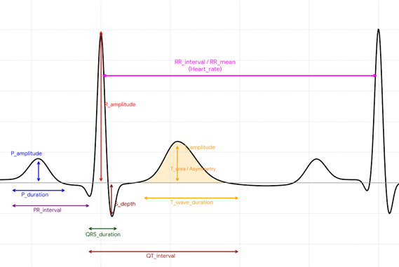

# Inferencia de Sexo a partir de señales ECG normales

### Descripción general

Este proyecto tiene como objetivo, el implementar los conocimientos adquiridos en Machine Learning y Ciencia de Datos a un pipeline basado en enfoques reales. Es un proyecto que lejos de desarrollarse, sirvió como aprendizaje.

#### Fundamentos de las señales ECG.

La utilización del complejo P-QRS-T en su totalidad como base para la inferencia automática del sexo se fundamenta en que el dimorfismo sexual no se manifiesta de forma aislada en un único evento bioeléctrico, sino que altera globalmente la cinética de despolarización y repolarización miocárdica. Las diferencias anatómicas, hormonales y de expresión de canales iónicos entre hombres y mujeres imprimen firmas electrofisiológicas sutiles pero consistentes a lo largo de todo el ciclo cardíaco.
Dado que el conjunto de entrenamiento, validación y prueba se compone exclusivamente de 9,694 registros de ECG normales de la derivación II provenientes del Shandong Provincial Hospital (SPH) Database, la variabilidad interindividual susceptible de ser explotada por los modelos de inteligencia artificial no reside en la detección de patologías, sino en las diferencias fisiológicas intrínsecas a la morfología del trazado electrocardiográfico. Por consiguiente, la inferencia automática del sexo a partir de señales ECG exige una caracterización precisa de los atributos morfológicos del complejo P-QRS-T amplitudes, duraciones, intervalos y relaciones espacio-temporales entre ondas, además de un fuerte patrón asociado a la despolarización de los cuales han sido documentados en la literatura cardiológica como biomarcadores diferenciales entre sexos.



## Guía de uso

**El proyecto usa:**

- Python 3.8

```bash
python -m venv .venv
```

**Instalación:**

```bash
git clone https://github.com/rgz-Cristian/ECG-Sex.git
cd ECG-Sex
```

**Dependencias:**

```bash
pip install -r requirements.txt
```

**Puedes ejecutar los notebooks para entender el flujo!!**

#### Notas

Se excluyen los datos físicos usados para la extracción de rasgos

**Fuente:** El conjunto de entrenamiento, validación y prueba se compone exclusivamente de 9,694 registros de ECG normales de la derivación II provenientes del Shandong Provincial Hospital (SPH) Database.
